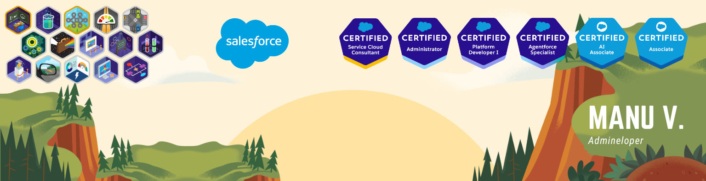

<div align="center">
  
[](https://git.io/typing-svg)

</div>

💻 I'm currently fueling my passion for Salesforce, diving deep into the world of Apex, LWC, and continuously expanding my knowledge in the Salesforce ecosystem. 

📫 How to reach me **contacto@manuvillen.com**

#### _Data export on me_
```sql
SELECT Id,
  (SELECT 🚀 Improving FROM Salesforce_Development_Practices__r),
  (SELECT 📚 Learning FROM New_Technologies_And_Frameworks__r),
  (SELECT 🌐 Contributing FROM Salesforce_Community__r),
  🥇 Credentials, 🏅 Superbadges, ⚙ TechSkills
FROM Developer__c
WHERE Name LIKE 'Man%'
  AND Passion_Age__c >= 30
```

## ☁ Salesforce Credentials

<!--TH_Stats:start-->
undefined
<!--TH_Stats:end-->

## ⚙ Tech Skills

<div align="center">
  


</div>

<div align="center">
  
  
</div>

>[!NOTE]
>_Most Used Languages_ do not indicate my skill level or anything like that. It is just a metric of which languages have been hosted by me on GitHub based on their usage across repositories. There are others that I haven't uploaded to GitHub.

---

<div align="right">
  
[](https://linkedin.com/in/manuvillen)


</div>


<!-- 
Next update:
- https://github.com/anmol098/waka-readme-stats

-->
